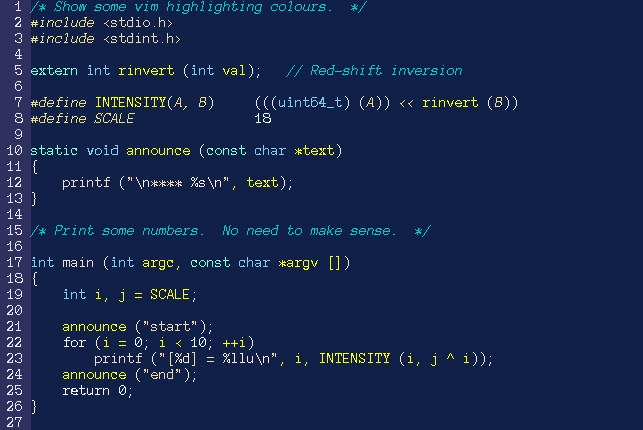

# vim bits-n-bobs

A couple of vim related files I use, handy to have them on the cloud :)

## dotvimrc
My minimal(ish) `.vimrc` file.

## colors/bluish.vim
Even more minimal vaguely dark-blue-themed vim color scheme.  Needs to live in ~/vim/colors.
Works on xterms too.
Inline-style: 

## License
MIT License, see LICENSE file.

